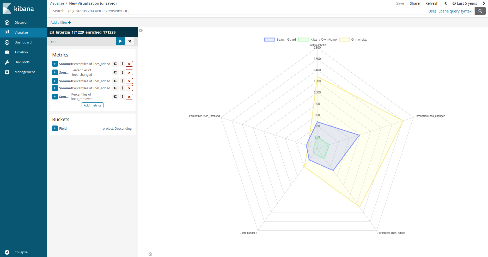

# Radar visualization for Kibana

This is a plugin developed for Kibana that you can build radar visualziations

## Installation Steps from Kibana docs

    cd KIBANA_HOME
    ./bin/kibana-plugin install \
        https://github.com/dlumbrer/kbn_radar/releases/download/Kibana-6.X/kbn_radar.zip


## Installation Steps from release

1. Go to [releases](https://github.com/dlumbrer/kbn_radar/releases "Go to releases!") and download the right one for your Kibana
2. unzip/untar it into `KIBANA_HOME/plugins`
3. Start your Kibana


## Installation Steps from GitHub source code

1. Move into plugins folder:  `cd KIBANA_HOME/plugins`
2. Clone the source code (**it depends on your Kibana's version**):
    - Kibana 6: `git clone https://github.com/dlumbrer/kbn_radar.git -b 6-dev`

3. Install dependencies:
      ```
      cd kbn_radar
      npm install
      ```
4. Start Kibana

> **Important:** If you have any problem with the plugin version (like a warning message "**it expected Kibana version "x.x.x", and found "x.x.x"**") only change the value of the "version" tag on the package.json to your Kibana version


#### Uninstall:
```
cd KIBANA_HOME
rm -rf plugins/kbn_radar/
```
or
```
cd KIBANA_HOME
./bin/kibana-plugin remove kbn_radar
```


# Example of use




## Help me to improve! :smile:

If there's any problem or doubt, please, open a Github Issue (Pull Request) or contact me via email (dmorenolumb@gmail.com). It would be very helpful if you tried it and tell me what you think of it, the errors and the possible improves that I could make.


#### For anything, contact me: dmorenolumb@gmail.com
